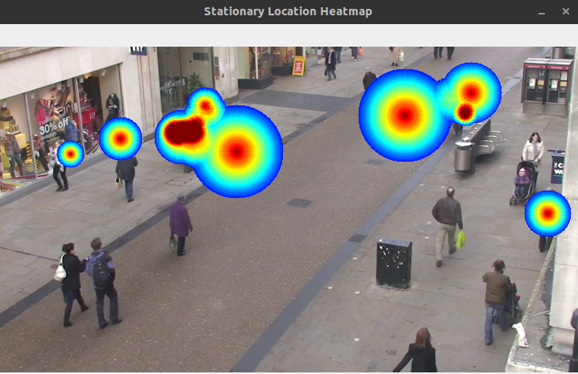
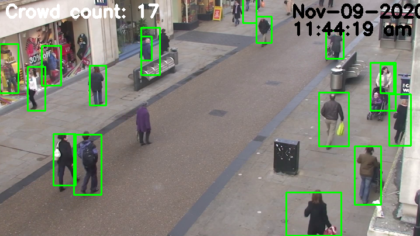

# Crowd-Analysis

The project is dedicated to apply on CCTV and other survailance system for simple crowd monitoring and crowd analysis. The system is able to monitor for abnormal crowd activity, social distance violation and restricted entry. The other part of the system can then process crowd movement data into optical flow, heatmap and energy graph.

Abnormal crowd activity is monitored by computing crowd movement energy level.

Social distace violation is simply calculating distance between individuals. Two modes are given to calculate distance from edge of individuals or center of individuals from camera at different scenario.

Human detection is implemented using YOLOv4 via OpenCV built-in function. Tracking algorithm is implemented using Deep SORT, referencing the implementation by [Python Lessons](https://github.com/pythonlessons/TensorFlow-2.x-YOLOv3).

Current functions implemented includes:

- Social distance rule violation
- Entries to restriced areas
- Abnormal crowd movement/activity
- Crowd movement tracks and flow
- Crowd stationaries point (Heatmap)

---

**I am happy to talk about the project if you have any question or discussion!**

---

## Building

YOLOv4-tiny is used for this documentation. You can use other YOLO variation for desire usage and output.

### Files

Clone this repo. Then, create a folder ```YOLOv4-tiny```, download and put in the weight and config file. The files can be found here, [yolov4-tiny.weights](https://github.com/AlexeyAB/darknet/releases/download/darknet_yolo_v4_pre/yolov4-tiny.weights) and [yolov4-tiny.cfg](https://github.com/AlexeyAB/darknet/blob/master/cfg/yolov4-tiny.cfg). Or you can just run the scirpt below.

```shell
git clone https://github.com/lewjiayi/Crowd-Analysis.git
cd Crowd-Analysis
mkdir YOLOv4-tiny
wget -P YOLOv4-tiny https://github.com/AlexeyAB/darknet/releases/download/yolov4/yolov4-tiny.weights
wget -P YOLOv4-tiny https://raw.githubusercontent.com/AlexeyAB/darknet/master/cfg/yolov4-tiny.cfg
```

### Requirements

Install the requirements

```shell
pip3 install requirements.txt
```

## Configuration

`config.py` contains all configurations for this program.

Place the **video source** under `VIDEO_CONFIG.VIDEO_CAP` in `config.py`

Refer to [User Manual](#user-manual) on how to use the `config.py` file.

## Running

Before you run the program, make sure you have input a valid **video source**. You have to provide your own video for the program. Replace the path at `VIDEO_CONFIG.VIDEO_CAP` in `config.py` with the path of your own video.

To process a video, run `main.py`

```shell
python3 main.py
```

`main.py` will yield a set of data from the video source in the form of csv and json. These data will be placed in the directory `processed_data`.

From these data, you can generate movement data, crowd summary and abnormal crowd movement.

```shell
python3 abnormal_data_process.py
python3 crowd_data_present.py
python3 movement_data_present.py
```

`abnormal_data_process.py` will yield a summary for the processed energy data set and a graph of energy level over count. This process will clean outlier if the data set has a skewness larger than 7.5

`crowd_data_present.py` will yield a heatmap and optical flow. Optical flow shows the tracks of each individual. Heatmap shows the spot where individuals stop; the stronger the color, the longer or more individual stop at the given spot.

`movement_data_present.py` will yield a summary plot of crowd count, violation count, restricted entry detection and abnormal activity over time(frames).

## Sample Output

### Optical flow of crowd movement


### Stationary location Heatmap



### Detection & Tracking



### Social distance violation


### Video summary


### Energy level graph


## User Manual

### VIDEO_CONFIG

Configuration for video input.

|Video configuration| Description |
|-                  |-|
| VIDEO_CAP         | Video path. Put integer 0 for webcam |
| IS_CAM            | Is the video input real-time. The value accept boolean |
|CAM_APPROX_FPS     |If it is real time, input an approximate processing speed according. The value affects the data analysis, not video processing. The system can be run for 5 minutes to compute a rough processing speed. |
|HIGH_CAM           |Position of the camera. The value accepts boolean. This will affect the algorithm used to calculate distance for social distance checking. |
|START_TIME         |Start time of the video process. In the format of (Y:M:D:H:M:S:ms)

### YOLO_CONFIG

YOLO weight and cfg path. Warning! Do not touch without knowledge on OpenCV YOLO implementation.
| YOLO Configuration    | Description |
|-                      |-|
|WEIGHTS_PATH           | YOLO weight path |
|CONFIG_PATH            | YOLO config path |

### Other configuration

| Configuration         | Description |
|-                      |-|
|SHOW_PROCESSING_OUTPUT | To show the video output when processing. The value accepts boolean values. For true,the output will be shown. For false, the console will print a line “processing..” to let the user know the system is working.|
|SHOW_DETECT            | To show individuals detected. The value accepts boolean values. For true, a green bounding box will be drawn over the detected person. For false, nothing will be done.|
|DATA_RECORD            | To record data into files. The value accepts boolean values. For true, the data will be collected and recorded into file. For false, the data will not be collected, using lesser memory for the system.|
|DATA_RECORD_RATE       | The rate of data recording, used only for pre-recorded video processing. The value accepts integer not more than video FPS. For example, value of 10 indicates 10 data will be recorded per frame|
|RE_CHECK               | To check for restricted entry. The value accepts boolean values. For true, restricted entry will be checked. For false, nothing will be done.|
|RE_START_TIME          | Restricted entry timer start time. In the format of (H:M:S)|
|RE_END_TIME            | Restricted entry timer start time. In the format of (H:M:S)|
|SD_CHECK               | To check for social distance violations. The value accepts boolean values. For true, social distance will be checked. For false, nothing will be done.|
|SHOW_VIOLATION_COUNT   | To display social distance violation count. The value accepts boolean values. For true, social distance count will be displayed. For false, nothing will be done.|
|SHOW_TRACKING_ID       | To display the tracking id of the detected object. The value accepts boolean values. For true, tracking id of the detected object will be displayed. For false, nothing will be done.|
|SOCIAL_DISTANCE        | Minimum distance for social distance, in terms of pixels. The value accepts integer value.  The default value is 50.|
|ABNORMAL_CHECK         | To check for abnormal crowd activity. The value accepts boolean values. For true, abnormal crowd activity will be checked. For false, nothing will be done.|
|ABNORMAL_MIN_PEOPLE    | The minimum number of people to exist in the frame before abnormal activity will be checked. The value accepts integers. The default value is 5. |
|ABNORMAL_ENERGY        | Threshold for energy to be classified as abnormal energy. The value accepts integers. The value should be computed with abnormal_data_process.py when data is extracted from a video.|
|ABNORMAL_THRESH        | Threshold for the ratio of abnormal energy count over the total detected person to trigger abnormal activity warning. The value accepts float and should be between 0 to 1. The default value is 0.66.|
|MIN_CONF               | Threshold for YOLO human detection minimum confidence. The value accepts float and should be between 0 to 1. The default value is 0.3. Warning, best not to change the value without prior knowledge on YOLO|
|NMS_THRESH             | Threshold for Non-maxima suppression on detected objects from YOLO. The value accepts float and should be between 0 to 1. The default value is 0.2. Warning, best not to change the value without prior knowledge on YOLO and NMS|
|FRAME_SIZE             | Frame size to be resized and used in video processing. The value accepts integers and should be between 480 to 1920. The default value is 720.|
|TRACK_MAX_AGE          | Tracker max missing age before removing in terms of seconds. The value accepts integers. The default value is 3. Warning! Do not change the value without prior knowledge on Deep SORT and object detection on video.
